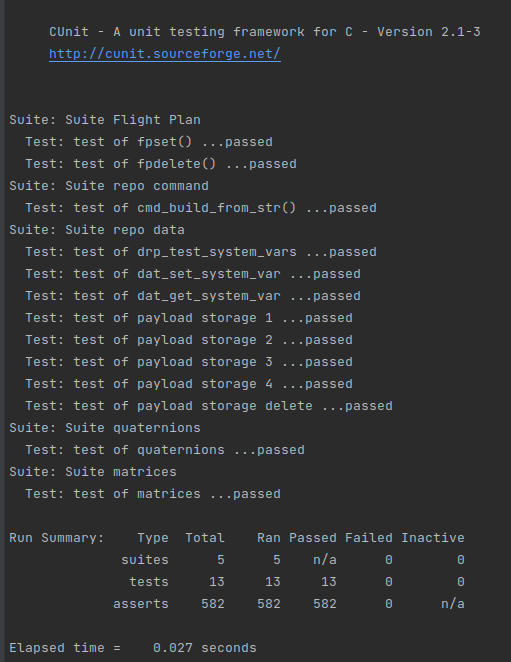

# Test Unit

## Objective

The purpose of the test is:
- check that the commands are processed correctly, tests are made for correct 
and invalid commands and with or without arguments.
- check commands related to the flight plan, the data repository, the quaternions 
library and matrices usage.

## Compile

Before compiling, it's necessary to install CUnit, to do this use:

> sudo apt-get install libcunit1 libcunit1-doc libcunit1-dev

To compile the test type:
> cmake -B build-test -DAPP=test_unit -DTEST=1 -DSCH_STORAGE_TRIPLE_WR=1 && cmake --build build-test

the build-test folder can be replaced by any desired name.

## Run

To run the experiment type

> ./build-test/test/test_unit/suchai-test

## Expected results

The following information should appear in the terminal:

It's necessary to ensure that all test passed.